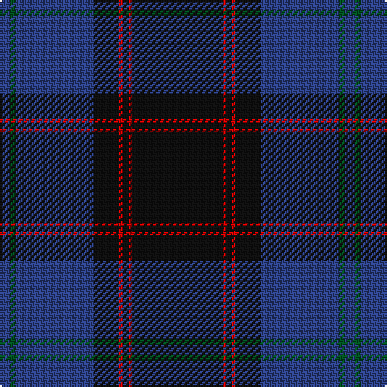

The parent of this is [Home or Hume (Vestiarium Scoticum)](/tartans/b/6/g4/b48/k16/r2/k4/r2/k/56/)

This was sourced from register-of-tartans.  It is a [8 stripes tartan](/stripes/stripes8/).

Original link https://www.tartanregister.gov.uk/tartanDetails.aspx?ref=1758

## Thread count
B/6 G4 B48 K16 R2 K4 R2 K/56

## Palette
Each colour and its ΔE from the base-6 reference it is a variant of.

| Colour | Shade | Base | ΔE (OKLab) |
|---|---|---|---|
| B |  `#2C4084` | B  | 0.00 |
| G |  `#005020` | G  | 0.08 |
| K |  `#101010` | K  | 0.17 |
| R |  `#DC0000` | R  | 0.04 |

# Sample pattern

ID: /variants/b/6/g4/b48/k16/r2/k4/r2/k/56-b2c4084-g005020-k101010-rdc0000/
