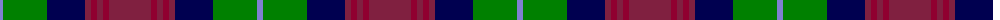

The parent of this is [Akins](/tartans/b/6/g44/db38/dr6/dra6/dr6/dra6/dr/42/)

This was sourced from weddslist.  It is a [8 stripes tartan](/stripes/stripes8/).

Original link http://www.weddslist.com/cgi-bin/tartans/pg.pl?source=sts

## Thread count
B/6 G44 DB38 DR6 DRa6 DR6 DRa6 DR/42

## Palette
Each colour and its ΔE from the base-6 reference it is a variant of.

| Colour | Shade | Base | ΔE (OKLab) |
|---|---|---|---|
| B |  `#8080D0` | B  | 0.24 |
| DB |  `#000050` | B  | 0.20 |
| DR |  `#802040` | R  | 0.16 |
| DRa |  `#900030` | R  | 0.13 |
| G |  `#008000` | G  | 0.09 |

# Sample pattern

ID: /variants/b/6/g44/db38/dr6/dra6/dr6/dra6/dr/42-b8080d0-db000050-dr802040-dra900030-g008000/
