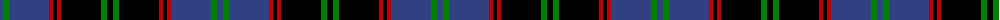

The parent of this is [Hume, or Home](/tartans/b/6/g6/b40/r4/k4/r4/k40/g6/k/6/)

This was sourced from weddslist.  It is a [9 stripes tartan](/stripes/stripes9/).

Original link http://www.weddslist.com/cgi-bin/tartans/pg.pl?source=sts

## Thread count
B/6 G6 B40 R4 K4 R4 K40 G6 K/6

## Palette
Each colour and its ΔE from the base-6 reference it is a variant of.

| Colour | Shade | Base | ΔE (OKLab) |
|---|---|---|---|
| B |  `#304080` | B  | 0.01 |
| G |  `#008000` | G  | 0.09 |
| K |  `#000000` | K  | 0.00 |
| R |  `#C00000` | R  | 0.02 |

ID: /variants/b/6/g6/b40/r4/k4/r4/k40/g6/k/6-b304080-g008000-k000000-rc00000/
