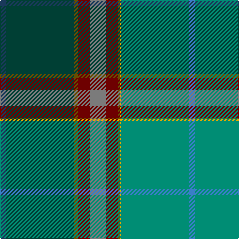

The parent of this is [Milling-Kristensen (Personal)](/tartans/b/6/g68/dy4/r12/ln/16/)

This was sourced from tartans-authority.  It is a [5 stripes tartan](/stripes/stripes5/).

Original link http://www.tartansauthority.com/tartan-ferret/display/10314/

## Thread count
B/6 G68 DY4 R12 LN/16

## Palette
Each colour and its ΔE from the base-6 reference it is a variant of.

| Colour | Shade | Base | ΔE (OKLab) |
|---|---|---|---|
| B |  `#3068A4` | B  | 0.12 |
| DY |  `#BC8C00` | Y  | 0.16 |
| G |  `#007460` | G  | 0.11 |
| LN |  `#E0E0E0` | W  | 0.06 |
| R |  `#C80000` | R  | 0.00 |

# Sample pattern

ID: /variants/b/6/g68/dy4/r12/ln/16-b3068a4-dybc8c00-g007460-lne0e0e0-rc80000/
