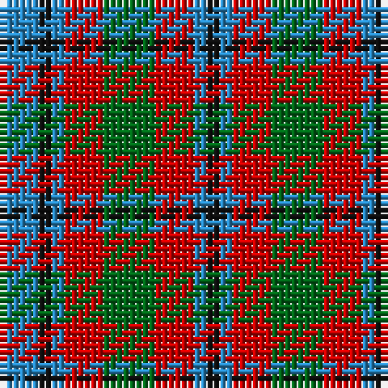

The parent of this is [Wilson's No.214](/tartans/b/6/k2/b2/r6/g8/r6/b2/k/2/)

This was sourced from register-of-tartans.  It is a [8 stripes tartan](/stripes/stripes8/).

Original link https://www.tartanregister.gov.uk/tartanDetails.aspx?ref=4745

## Thread count
B/6 K2 B2 R6 G8 R6 B2 K/2

## Palette
Each colour and its ΔE from the base-6 reference it is a variant of.

| Colour | Shade | Base | ΔE (OKLab) |
|---|---|---|---|
| B |  `#2888C4` | B  | 0.21 |
| DG |  `#003820` | G  | 0.16 |
| G |  `#006818` | G  | 0.02 |
| K |  `#101010` | K  | 0.17 |
| R |  `#C80000` | R  | 0.00 |

# Sample pattern

ID: /variants/b/6/k2/b2/r6/g8/r6/b2/k/2-b2888c4-dg003820-g006818-k101010-rc80000/
