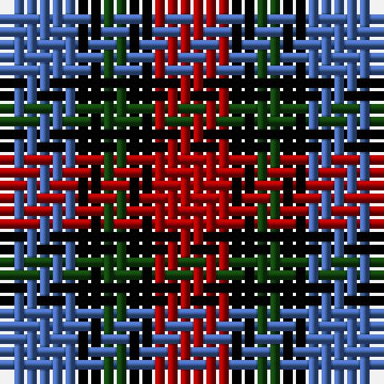

The parent of this is [Clark](/tartans/b/6/k2/dg2/k2/dr/6/)

This was sourced from weddslist.  It is a [5 stripes tartan](/stripes/stripes5/).

Original link http://www.weddslist.com/cgi-bin/tartans/pg.pl?source=x

## Thread count
B/6 K2 DG2 K2 DR/6

## Palette
Each colour and its ΔE from the base-6 reference it is a variant of.

| Colour | Shade | Base | ΔE (OKLab) |
|---|---|---|---|
| B |  `#4367AE` | B  | 0.13 |
| DG |  `#11450D` | G  | 0.10 |
| DR |  `#AA0000` | R  | 0.06 |
| K |  `#000000` | K  | 0.00 |

# Sample pattern

ID: /variants/b/6/k2/dg2/k2/dr/6-b4367ae-dg11450d-draa0000-k000000/
