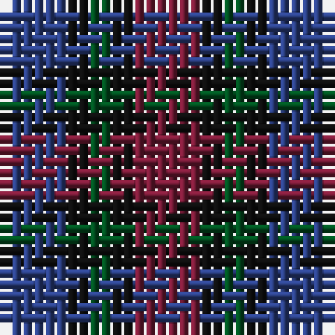

The parent of this is [Clark Clerk(e)](/tartans/b/6/k2/g2/k2/dr/6/)

This was sourced from register-of-tartans.  It is a [5 stripes tartan](/stripes/stripes5/).

Original link https://www.tartanregister.gov.uk/tartanDetails.aspx?ref=667

## Thread count
B/6 K2 G2 K2 DR/6

## Palette
Each colour and its ΔE from the base-6 reference it is a variant of.

| Colour | Shade | Base | ΔE (OKLab) |
|---|---|---|---|
| B |  `#2C4084` | B  | 0.00 |
| DR |  `#781C38` | R  | 0.17 |
| G |  `#005020` | G  | 0.08 |
| K |  `#101010` | K  | 0.17 |

# Sample pattern

ID: /variants/b/6/k2/g2/k2/dr/6-b2c4084-dr781c38-g005020-k101010/
