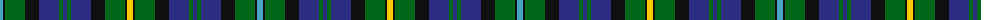

The parent of this is [Doon Valley Crafters (Corporate)](/tartans/b/6/k2/g20/k14/db20/g4/db4/g4/db20/k14/g20/k2/y/6/)

This was sourced from tartans-authority.  It is a [13 stripes tartan](/stripes/stripes13/).

Original link http://www.tartansauthority.com/tartan-ferret/display/10806/

## Thread count
B/6 K2 G20 K14 DB20 G4 DB4 G4 DB20 K14 G20 K2 Y/6

## Palette
Each colour and its ΔE from the base-6 reference it is a variant of.

| Colour | Shade | Base | ΔE (OKLab) |
|---|---|---|---|
| B |  `#48A4C0` | Y  | 0.28 |
| DB |  `#2C2C80` | B  | 0.05 |
| G |  `#006818` | G  | 0.02 |
| K |  `#101010` | K  | 0.17 |
| Y |  `#FCCC00` | Y  | 0.04 |

ID: /variants/b/6/k2/g20/k14/db20/g4/db4/g4/db20/k14/g20/k2/y/6-b48a4c0-db2c2c80-g006818-k101010-yfccc00/
