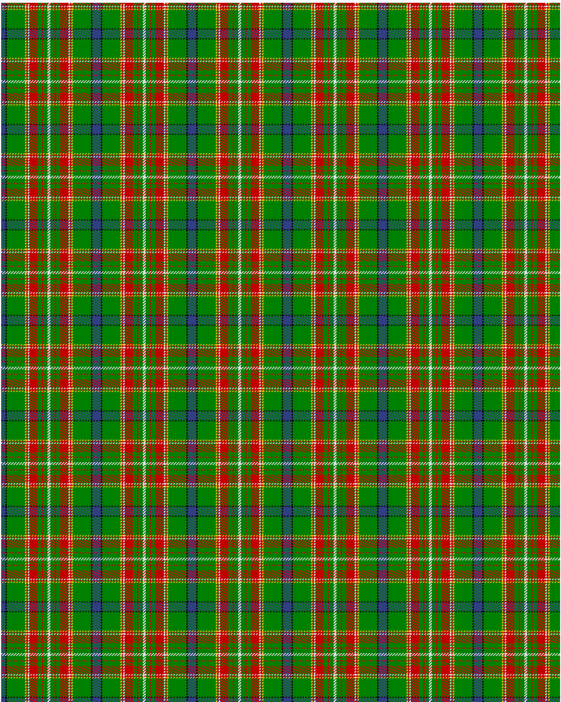

Canadian Caledonian, hunting

This was sourced from <no value>.  It is a 11 stripes tartan.

Original link http://www.weddslist.com/cgi-bin/tartans/pg.pl?source=sts

## Thread count
B/6 K2 G26 Y2 R2 LN2 R12 G6 R2 G6 LN/2

## Palette
B#304080 G#008000 K#000000 LN#E0E0E0 R#C00000 Y#F0C000

# Sample pattern

ID: /variants/b/6/k2/g26/y2/r2/ln2/r12/g6/r2/g6/ln/2-b304080-g008000-k000000-lne0e0e0-rc00000-yf0c000