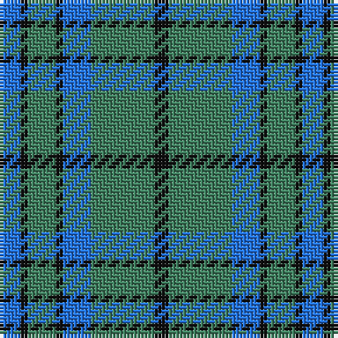

The parent of this is [Outdoorsmen (Fashion)](/tartans/b/6/k2/g8/k2/b8/g18/k/4/)

This was sourced from tartans-authority.  It is a [7 stripes tartan](/stripes/stripes7/).

Original link http://www.tartansauthority.com/tartan-ferret/display/8037/

## Thread count
B/6 K2 G8 K2 B8 G18 K/4

## Palette
Each colour and its ΔE from the base-6 reference it is a variant of.

| Colour | Shade | Base | ΔE (OKLab) |
|---|---|---|---|
| B |  `#2474E8` | B  | 0.20 |
| G |  `#408060` | G  | 0.13 |
| K |  `#101010` | K  | 0.17 |

# Sample pattern

ID: /variants/b/6/k2/g8/k2/b8/g18/k/4-b2474e8-g408060-k101010/
