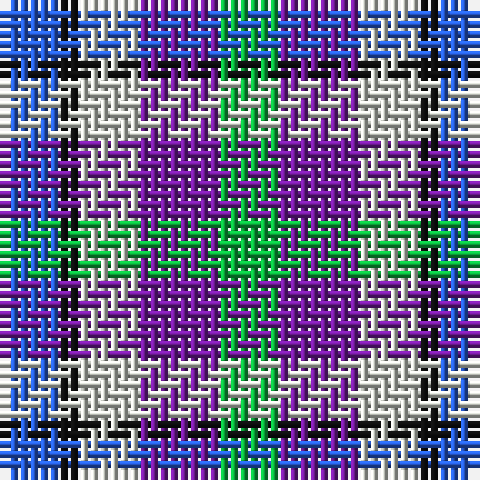

The parent of this is [Crinnion (Middlesbrough) (Personal)](/tartans/b/6/k2/n6/p8/g/6/)

This was sourced from register-of-tartans.  It is a [5 stripes tartan](/stripes/stripes5/).

Original link https://www.tartanregister.gov.uk/tartanDetails.aspx?ref=10789

## Thread count
B/6 K2 N6 P8 G/6

## Palette
Each colour and its ΔE from the base-6 reference it is a variant of.

| Colour | Shade | Base | ΔE (OKLab) |
|---|---|---|---|
| B |  `#275EDC` | B  | 0.16 |
| G |  `#0BB43F` | Y  | 0.22 |
| K |  `#101010` | K  | 0.17 |
| N |  `#D1D5CD` | W  | 0.10 |
| P |  `#761CA0` | B  | 0.15 |

# Sample pattern

ID: /variants/b/6/k2/n6/p8/g/6-b275edc-g0bb43f-k101010-nd1d5cd-p761ca0/
