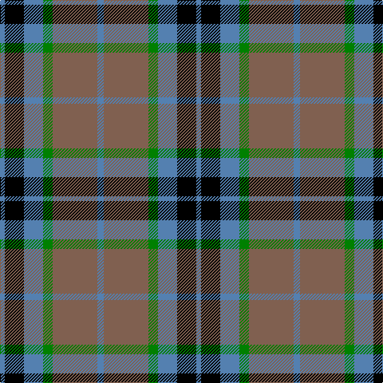

The parent of this is [Thom(p)son, Lord (hunting)](/tartans/b/6/k24/b24/g12/lt56/b/8/)

This was sourced from weddslist.  It is a [6 stripes tartan](/stripes/stripes6/).

Original link http://www.weddslist.com/cgi-bin/tartans/pg.pl?source=sts

## Thread count
B/6 K24 B24 G12 LT56 B/8

## Palette
Each colour and its ΔE from the base-6 reference it is a variant of.

| Colour | Shade | Base | ΔE (OKLab) |
|---|---|---|---|
| B |  `#5480B0` | B  | 0.20 |
| G |  `#008000` | G  | 0.09 |
| K |  `#000000` | K  | 0.00 |
| LT |  `#806050` | R  | 0.17 |

# Sample pattern

ID: /variants/b/6/k24/b24/g12/lt56/b/8-b5480b0-g008000-k000000-lt806050/
