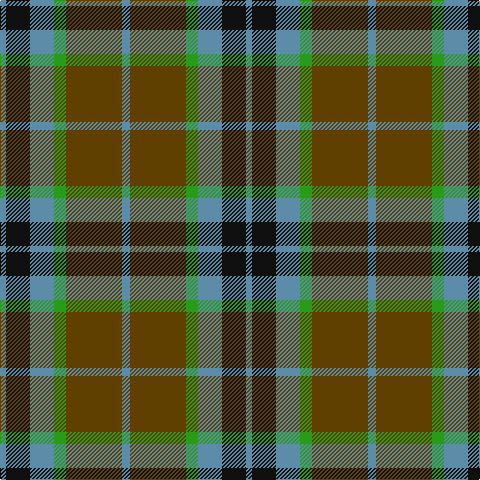

The parent of this is [Thomson (Clan)](/tartans/b/6/k24/b24/g12/t56/b/8/)

This was sourced from tartans-authority.  It is a [6 stripes tartan](/stripes/stripes6/).

Original link http://www.tartansauthority.com/tartan-ferret/display/231/

## Thread count
B/6 K24 B24 G12 T56 B/8

## Palette
Each colour and its ΔE from the base-6 reference it is a variant of.

| Colour | Shade | Base | ΔE (OKLab) |
|---|---|---|---|
| B |  `#5C8CA8` | B  | 0.23 |
| G |  `#289C18` | G  | 0.18 |
| K |  `#101010` | K  | 0.17 |
| T |  `#604000` | G  | 0.14 |

# Sample pattern

ID: /variants/b/6/k24/b24/g12/t56/b/8-b5c8ca8-g289c18-k101010-t604000/
