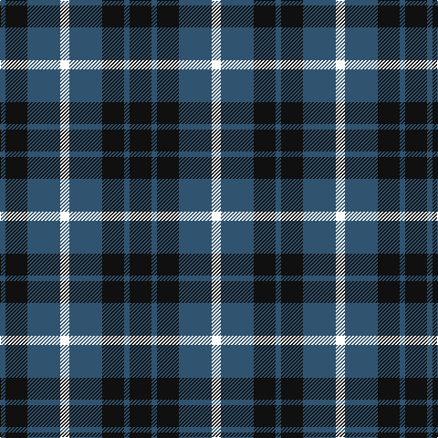

The parent of this is [Grampian Television](/tartans/b/6/k24/b36/w10/b36/k24/b6/k/24/)

This was sourced from register-of-tartans.  It is a [8 stripes tartan](/stripes/stripes8/).

Original link https://www.tartanregister.gov.uk/tartanDetails.aspx?ref=1491

## Thread count
B/6 K24 B36 W10 B36 K24 B6 K/24

## Palette
Each colour and its ΔE from the base-6 reference it is a variant of.

| Colour | Shade | Base | ΔE (OKLab) |
|---|---|---|---|
| B |  `#305470` | B  | 0.08 |
| K |  `#101010` | K  | 0.17 |
| W |  `#FCFCFC` | W  | 0.03 |

# Sample pattern

ID: /variants/b/6/k24/b36/w10/b36/k24/b6/k/24-b305470-k101010-wfcfcfc/
