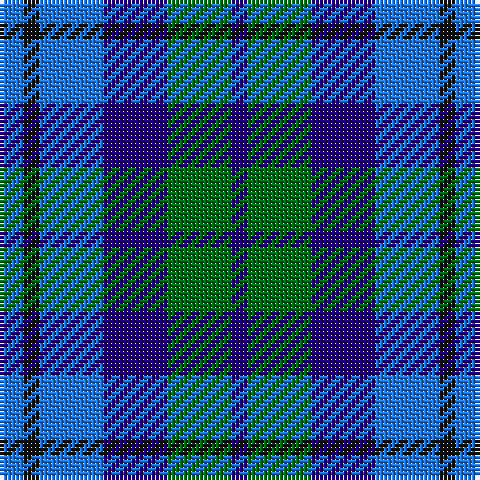

The parent of this is [Black Watch (Pendleton)](/tartans/b/6/k4/b16/db16/g16/db/4/)

This was sourced from register-of-tartans.  It is a [6 stripes tartan](/stripes/stripes6/).

Original link https://www.tartanregister.gov.uk/tartanDetails.aspx?ref=5048

## Thread count
B/6 K4 B16 DB16 G16 DB/4

## Palette
Each colour and its ΔE from the base-6 reference it is a variant of.

| Colour | Shade | Base | ΔE (OKLab) |
|---|---|---|---|
| B |  `#2474E8` | B  | 0.20 |
| DB |  `#1C0070` | B  | 0.14 |
| G |  `#006818` | G  | 0.02 |
| K |  `#101010` | K  | 0.17 |

# Sample pattern

ID: /variants/b/6/k4/b16/db16/g16/db/4-b2474e8-db1c0070-g006818-k101010/
