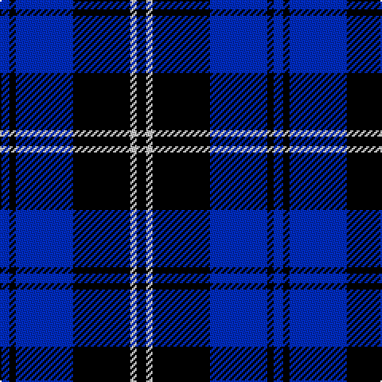

The parent of this is [Swan (Name)](/tartans/b/6/k4/b36/k36/n4/k/6/)

This was sourced from tartans-authority.  It is a [6 stripes tartan](/stripes/stripes6/).

Original link http://www.tartansauthority.com/tartan-ferret/display/5164/

## Thread count
B/6 K4 B36 K36 N4 K/6

## Palette
Each colour and its ΔE from the base-6 reference it is a variant of.

| Colour | Shade | Base | ΔE (OKLab) |
|---|---|---|---|
| B |  `#002CC0` | B  | 0.11 |
| K |  `#000000` | K  | 0.00 |
| N |  `#C8C8C8` | W  | 0.13 |

# Sample pattern

ID: /variants/b/6/k4/b36/k36/n4/k/6-b002cc0-k000000-nc8c8c8/
