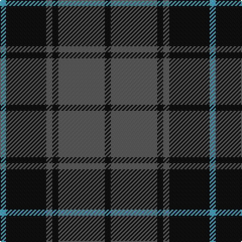

The parent of this is [Pride of the Forth](/tartans/b/6/k40/n6/k6/n46/k/6/)

This was sourced from tartans-authority.  It is a [6 stripes tartan](/stripes/stripes6/).

Original link http://www.tartansauthority.com/tartan-ferret/display/11060/

## Thread count
B/6 K40 N6 K6 N46 K/6

## Palette
Each colour and its ΔE from the base-6 reference it is a variant of.

| Colour | Shade | Base | ΔE (OKLab) |
|---|---|---|---|
| B |  `#48A4C0` | Y  | 0.28 |
| K |  `#101010` | K  | 0.17 |
| N |  `#5C5C5C` | B  | 0.14 |

# Sample pattern

ID: /variants/b/6/k40/n6/k6/n46/k/6-b48a4c0-k101010-n5c5c5c/
