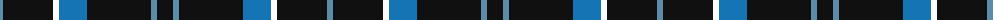

The parent of this is [Cowe (Personal)](/tartans/b/6/k50/w6/ba28/k64/b6/k/16/)

This was sourced from tartans-authority.  It is a [7 stripes tartan](/stripes/stripes7/).

Original link http://www.tartansauthority.com/tartan-ferret/display/6186/

## Thread count
B/6 K50 W6 Ba28 K64 B6 K/16

## Palette
Each colour and its ΔE from the base-6 reference it is a variant of.

| Colour | Shade | Base | ΔE (OKLab) |
|---|---|---|---|
| B |  `#5C8CA8` | B  | 0.23 |
| Ba |  `#1474B4` | B  | 0.15 |
| K |  `#101010` | K  | 0.17 |
| W |  `#FCFCFC` | W  | 0.03 |

# Sample pattern

ID: /variants/b/6/k50/w6/ba28/k64/b6/k/16-b5c8ca8-ba1474b4-k101010-wfcfcfc/
