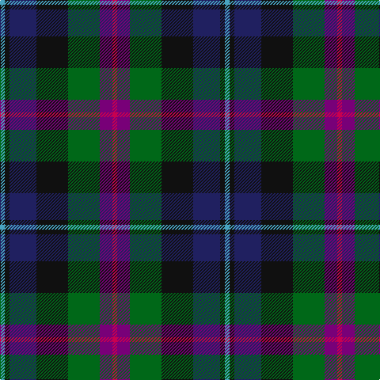

The parent of this is [Gracey (2013)](/tartans/b/6/k6/db34/k40/g40/p16/r/6/)

This was sourced from tartans-authority.  It is a [7 stripes tartan](/stripes/stripes7/).

Original link http://www.tartansauthority.com/tartan-ferret/display/10874/

## Thread count
B/6 K6 DB34 K40 G40 P16 R/6

## Palette
Each colour and its ΔE from the base-6 reference it is a variant of.

| Colour | Shade | Base | ΔE (OKLab) |
|---|---|---|---|
| B |  `#48A4C0` | Y  | 0.28 |
| DB |  `#202060` | B  | 0.11 |
| G |  `#006818` | G  | 0.02 |
| K |  `#101010` | K  | 0.17 |
| P |  `#780078` | B  | 0.16 |
| R |  `#C80050` | R  | 0.07 |

# Sample pattern

ID: /variants/b/6/k6/db34/k40/g40/p16/r/6-b48a4c0-db202060-g006818-k101010-p780078-rc80050/
