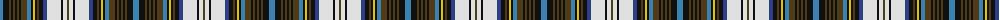

The parent of this is [Unidentified #18](/tartans/b/6/k6/t2/k2/t2/k2/t2/k2/t6/b4/k2/y2/k2/t2/k4/ba4/ln14/k2/ln4/t/2/)

This was sourced from register-of-tartans.  It is a [20 stripes tartan](/stripes/stripes20/).

Original link https://www.tartanregister.gov.uk/tartanDetails.aspx?ref=4219

## Thread count
B/6 K6 T2 K2 T2 K2 T2 K2 T6 B4 K2 Y2 K2 T2 K4 Ba4 LN14 K2 LN4 T/2

## Palette
Each colour and its ΔE from the base-6 reference it is a variant of.

| Colour | Shade | Base | ΔE (OKLab) |
|---|---|---|---|
| B |  `#3C82AF` | B  | 0.20 |
| Ba |  `#2C4084` | B  | 0.00 |
| K |  `#101010` | K  | 0.17 |
| LN |  `#E0E0E0` | W  | 0.06 |
| T |  `#503C14` | G  | 0.15 |
| Y |  `#E8C000` | Y  | 0.00 |

ID: /variants/b/6/k6/t2/k2/t2/k2/t2/k2/t6/b4/k2/y2/k2/t2/k4/ba4/ln14/k2/ln4/t/2-b3c82af-ba2c4084-k101010-lne0e0e0-t503c14-ye8c000/
