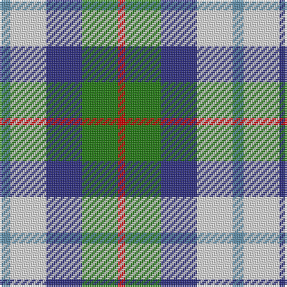

The parent of this is [MacTeddy](/tartans/b/6/ln20/db20/g20/r/4/)

This was sourced from tartans-authority.  It is a [5 stripes tartan](/stripes/stripes5/).

Original link http://www.tartansauthority.com/tartan-ferret/display/3985/

## Thread count
B/6 LN20 DB20 G20 R/4

## Palette
Each colour and its ΔE from the base-6 reference it is a variant of.

| Colour | Shade | Base | ΔE (OKLab) |
|---|---|---|---|
| B |  `#5C8CA8` | B  | 0.23 |
| DB |  `#2C2C80` | B  | 0.05 |
| G |  `#207810` | G  | 0.07 |
| LN |  `#E0E0E0` | W  | 0.06 |
| R |  `#C80000` | R  | 0.00 |

# Sample pattern

ID: /variants/b/6/ln20/db20/g20/r/4-b5c8ca8-db2c2c80-g207810-lne0e0e0-rc80000/
