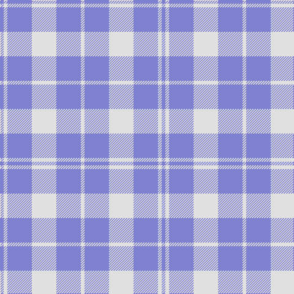

The parent of this is [Unidentified, Plaid Barbie's Moss](/tartans/b/6/ln6/b40/ln40/b40/ln/6/)

This was sourced from weddslist.  It is a [6 stripes tartan](/stripes/stripes6/).

Original link http://www.weddslist.com/cgi-bin/tartans/pg.pl?source=sts

## Thread count
B/6 LN6 B40 LN40 B40 LN/6

## Palette
Each colour and its ΔE from the base-6 reference it is a variant of.

| Colour | Shade | Base | ΔE (OKLab) |
|---|---|---|---|
| B |  `#8080D0` | B  | 0.24 |
| LN |  `#E0E0E0` | W  | 0.06 |

# Sample pattern

ID: /variants/b/6/ln6/b40/ln40/b40/ln/6-b8080d0-lne0e0e0/
