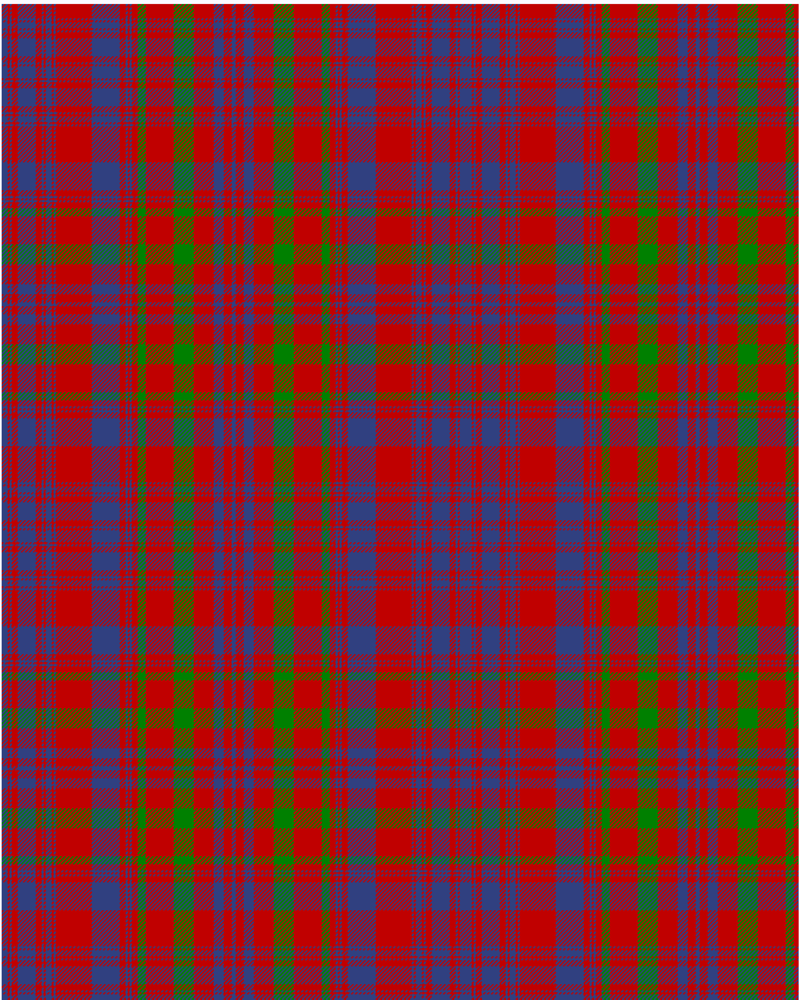

Campbell of Loudoun, Plaid

This was sourced from <no value>.  It is a 25 stripes tartan.

Original link http://www.weddslist.com/cgi-bin/tartans/pg.pl?source=sts

## Thread count
B/6 R2 B2 R6 B18 R6 B2 R2 B6 R2 B2 R36 B28 R6 B2 R2 B2 R6 G8 R28 G20 R20 B10 R8 B/2

## Palette
B#304080 G#008000 R#C00000

# Sample pattern

ID: /variants/b/6/r2/b2/r6/b18/r6/b2/r2/b6/r2/b2/r36/b28/r6/b2/r2/b2/r6/g8/r28/g20/r20/b10/r8/b/2-b304080-g008000-rc00000