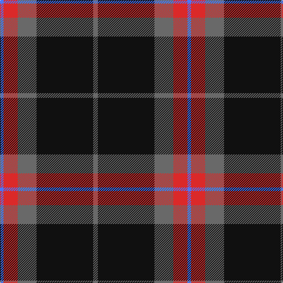

The parent of this is [Calgary Firefighters](/tartans/b/6/r24/n32/k96/n/8/)

This was sourced from register-of-tartans.  It is a [5 stripes tartan](/stripes/stripes5/).

Original link https://www.tartanregister.gov.uk/tartanDetails.aspx?ref=10484

## Thread count
B/6 R24 N32 K96 N/8

## Palette
Each colour and its ΔE from the base-6 reference it is a variant of.

| Colour | Shade | Base | ΔE (OKLab) |
|---|---|---|---|
| B |  `#4876FF` | B  | 0.24 |
| K |  `#101010` | K  | 0.17 |
| N |  `#696969` | G  | 0.17 |
| R |  `#DB2929` | R  | 0.06 |

# Sample pattern

ID: /variants/b/6/r24/n32/k96/n/8-b4876ff-k101010-n696969-rdb2929/
