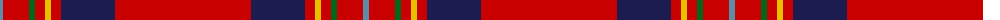

The parent of this is [De Nardi #2 (Personal)](/tartans/b/6/r26/g6/r10/y6/r10/db54/r/136/)

This was sourced from register-of-tartans.  It is a [8 stripes tartan](/stripes/stripes8/).

Original link https://www.tartanregister.gov.uk/tartanDetails.aspx?ref=5469

## Thread count
B/6 R26 G6 R10 Y6 R10 DB54 R/136

## Palette
Each colour and its ΔE from the base-6 reference it is a variant of.

| Colour | Shade | Base | ΔE (OKLab) |
|---|---|---|---|
| B |  `#5C8CA8` | B  | 0.23 |
| DB |  `#1C1C50` | B  | 0.14 |
| G |  `#006818` | G  | 0.02 |
| R |  `#C80000` | R  | 0.00 |
| Y |  `#E8C000` | Y  | 0.00 |

# Sample pattern

ID: /variants/b/6/r26/g6/r10/y6/r10/db54/r/136-b5c8ca8-db1c1c50-g006818-rc80000-ye8c000/
