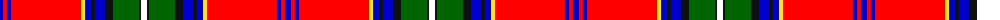

The parent of this is [Celtic Nations](/tartans/b/6/r4/b4/r70/y4/b6/k4/b10/k8/g26/k2/w/6/)

This was sourced from register-of-tartans.  It is a [12 stripes tartan](/stripes/stripes12/).

Original link https://www.tartanregister.gov.uk/tartanDetails.aspx?ref=10411

## Thread count
B/6 R4 B4 R70 Y4 B6 K4 B10 K8 G26 K2 W/6

## Palette
Each colour and its ΔE from the base-6 reference it is a variant of.

| Colour | Shade | Base | ΔE (OKLab) |
|---|---|---|---|
| B |  `#0000CD` | B  | 0.15 |
| G |  `#006400` | G  | 0.00 |
| K |  `#101010` | K  | 0.17 |
| R |  `#FF0000` | R  | 0.11 |
| W |  `#FFFFFF` | W  | 0.03 |
| Y |  `#FFE700` | Y  | 0.11 |

ID: /variants/b/6/r4/b4/r70/y4/b6/k4/b10/k8/g26/k2/w/6-b0000cd-g006400-k101010-rff0000-wffffff-yffe700/
