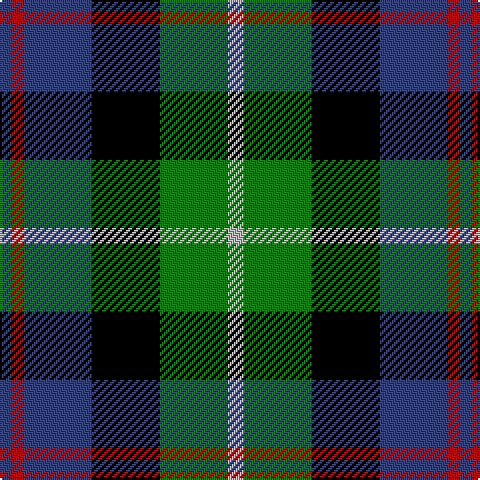

The parent of this is [Royal Highland](/tartans/b/6/r6/b34/k34/g34/n/8/)

This was sourced from weddslist.  It is a [6 stripes tartan](/stripes/stripes6/).

Original link http://www.weddslist.com/cgi-bin/tartans/pg.pl?source=sts

## Thread count
B/6 R6 B34 K34 G34 N/8

## Palette
Each colour and its ΔE from the base-6 reference it is a variant of.

| Colour | Shade | Base | ΔE (OKLab) |
|---|---|---|---|
| B |  `#304080` | B  | 0.01 |
| G |  `#008000` | G  | 0.09 |
| K |  `#000000` | K  | 0.00 |
| N |  `#B0B0B0` | Y  | 0.18 |
| R |  `#C00000` | R  | 0.02 |

# Sample pattern

ID: /variants/b/6/r6/b34/k34/g34/n/8-b304080-g008000-k000000-nb0b0b0-rc00000/
