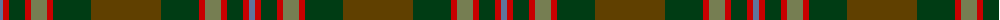

The parent of this is [John Muir Way](/tartans/b/6/r6/dg16/r6/g16/r6/dg38/t/70/)

This was sourced from register-of-tartans.  It is a [8 stripes tartan](/stripes/stripes8/).

Original link https://www.tartanregister.gov.uk/tartanDetails.aspx?ref=11022

## Thread count
B/6 R6 DG16 R6 G16 R6 DG38 T/70

## Palette
Each colour and its ΔE from the base-6 reference it is a variant of.

| Colour | Shade | Base | ΔE (OKLab) |
|---|---|---|---|
| B |  `#5F749C` | B  | 0.17 |
| DG |  `#003C14` | G  | 0.14 |
| G |  `#767E52` | G  | 0.17 |
| R |  `#C80000` | R  | 0.00 |
| T |  `#604000` | G  | 0.14 |

# Sample pattern

ID: /variants/b/6/r6/dg16/r6/g16/r6/dg38/t/70-b5f749c-dg003c14-g767e52-rc80000-t604000/
