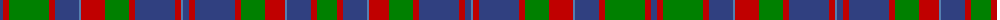

The parent of this is [Cumming](/tartans/b/6/r6/g40/r6/b24/ba2/r24/g24/r6/b40/r6/ba2/b6/r6/b40/r6/g24/r20/ba2/b24/r6/g/20/)

This was sourced from weddslist.  It is a [22 stripes tartan](/stripes/stripes22/).

Original link http://www.weddslist.com/cgi-bin/tartans/pg.pl?source=sts

## Thread count
B/6 R6 G40 R6 B24 Ba2 R24 G24 R6 B40 R6 Ba2 B6 R6 B40 R6 G24 R20 Ba2 B24 R6 G/20

## Palette
Each colour and its ΔE from the base-6 reference it is a variant of.

| Colour | Shade | Base | ΔE (OKLab) |
|---|---|---|---|
| B |  `#304080` | B  | 0.01 |
| Ba |  `#5480B0` | B  | 0.20 |
| G |  `#008000` | G  | 0.09 |
| R |  `#C00000` | R  | 0.02 |

ID: /variants/b/6/r6/g40/r6/b24/ba2/r24/g24/r6/b40/r6/ba2/b6/r6/b40/r6/g24/r20/ba2/b24/r6/g/20-b304080-ba5480b0-g008000-rc00000/
