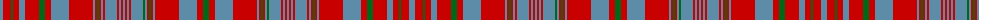

The parent of this is [Murray of Polmaise](/tartans/b/6/r8/g2/r6/b6/r14/g6/r6/b18/r24/b2/r2/g2/r2/b2/r2/b12/r2/b2/r2/b2/r2/b2/r2/b12/g2/b2/r2/g2/r2/b2/r24/b18/r6/g/6/)

This was sourced from register-of-tartans.  It is a [35 stripes tartan](/stripes/stripes35/).

Original link https://www.tartanregister.gov.uk/tartanDetails.aspx?ref=3068

## Thread count
B/6 R8 G2 R6 B6 R14 G6 R6 B18 R24 B2 R2 G2 R2 B2 R2 B12 R2 B2 R2 B2 R2 B2 R2 B12 G2 B2 R2 G2 R2 B2 R24 B18 R6 G/6

## Palette
Each colour and its ΔE from the base-6 reference it is a variant of.

| Colour | Shade | Base | ΔE (OKLab) |
|---|---|---|---|
| B |  `#5C8CA8` | B  | 0.23 |
| G |  `#006818` | G  | 0.02 |
| R |  `#C80000` | R  | 0.00 |

ID: /variants/b/6/r8/g2/r6/b6/r14/g6/r6/b18/r24/b2/r2/g2/r2/b2/r2/b12/r2/b2/r2/b2/r2/b2/r2/b12/g2/b2/r2/g2/r2/b2/r24/b18/r6/g/6-b5c8ca8-g006818-rc80000/
