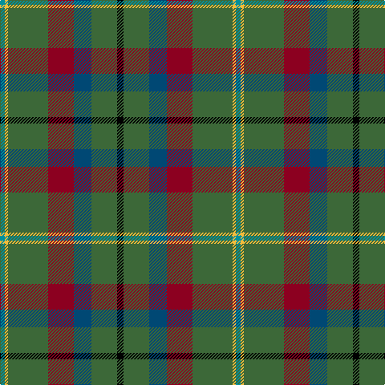

The parent of this is [Mayo Irish County Tartan Tartan Number: 2270. Earliest known date: 1994 One of a series of Irish District tartans designed by Polly Wittering of the House of Edgar, with colours reminiscent of the Country with soft warm colours dominating. See products available Copyright © Blair Urquhart, Comrie, 2015](/tartans/b/6/y4/g50/dr32/db22/g32/k/8/)

This was sourced from house-of-tartan.  It is a [7 stripes tartan](/stripes/stripes7/).

Original link http://www.house-of-tartan.scotland.net/house/TartanViewjs.asp?colr=Def&tnam=2270

## Thread count
B/6 Y4 G50 DR32 DB22 G32 K/8

## Palette
Each colour and its ΔE from the base-6 reference it is a variant of.

| Colour | Shade | Base | ΔE (OKLab) |
|---|---|---|---|
| B |  `#00909C` | G  | 0.21 |
| DB |  `#004874` | B  | 0.05 |
| DR |  `#8C0020` | R  | 0.13 |
| G |  `#3C6838` | G  | 0.07 |
| K |  `#000000` | K  | 0.00 |
| Y |  `#F4BC3C` | Y  | 0.03 |

# Sample pattern

ID: /variants/b/6/y4/g50/dr32/db22/g32/k/8-b00909c-db004874-dr8c0020-g3c6838-k000000-yf4bc3c/
