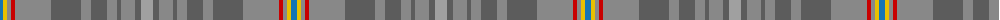

The parent of this is [Sandbaggers (Corporate)](/tartans/b/6/y4/nb4/r4/nb36/n30/nb10/n16/nb10/n4/nb14/n6/na/12/)

This was sourced from tartans-authority.  It is a [13 stripes tartan](/stripes/stripes13/).

Original link http://www.tartansauthority.com/tartan-ferret/display/8130/

## Thread count
B/6 Y4 Nb4 R4 Nb36 N30 Nb10 N16 Nb10 N4 Nb14 N6 Na/12

## Palette
Each colour and its ΔE from the base-6 reference it is a variant of.

| Colour | Shade | Base | ΔE (OKLab) |
|---|---|---|---|
| B |  `#1474B4` | B  | 0.15 |
| N |  `#5C5C5C` | B  | 0.14 |
| Na |  `#A0A0A0` | Y  | 0.20 |
| Nb |  `#888888` | R  | 0.24 |
| R |  `#C80000` | R  | 0.00 |
| Y |  `#E8C000` | Y  | 0.00 |

ID: /variants/b/6/y4/nb4/r4/nb36/n30/nb10/n16/nb10/n4/nb14/n6/na/12-b1474b4-n5c5c5c-naa0a0a0-nb888888-rc80000-ye8c000/
