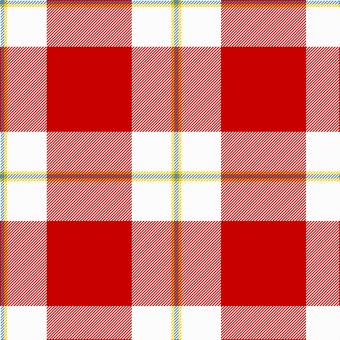

The parent of this is [Willis, H Graham](/tartans/b/6/y4/w56/r/120/)

This was sourced from tartans-authority.  It is a [4 stripes tartan](/stripes/stripes4/).

Original link http://www.tartansauthority.com/tartan-ferret/display/11283/

## Thread count
B/6 Y4 W56 R/120

## Palette
Each colour and its ΔE from the base-6 reference it is a variant of.

| Colour | Shade | Base | ΔE (OKLab) |
|---|---|---|---|
| B |  `#5C8CA8` | B  | 0.23 |
| R |  `#C80000` | R  | 0.00 |
| W |  `#FCFCFC` | W  | 0.03 |
| Y |  `#FCCC00` | Y  | 0.04 |

# Sample pattern

ID: /variants/b/6/y4/w56/r/120-b5c8ca8-rc80000-wfcfcfc-yfccc00/
