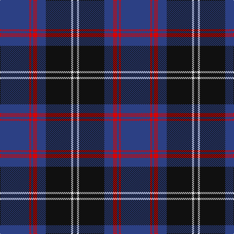

The parent of this is [Murdoch Celebration (Personal)](/tartans/b/60/r4/b4/r8/b18/k52/ln4/k/8/)

This was sourced from register-of-tartans.  It is a [8 stripes tartan](/stripes/stripes8/).

Original link https://www.tartanregister.gov.uk/tartanDetails.aspx?ref=5986

## Thread count
B/60 R4 B4 R8 B18 K52 LN4 K/8

## Palette
Each colour and its ΔE from the base-6 reference it is a variant of.

| Colour | Shade | Base | ΔE (OKLab) |
|---|---|---|---|
| B |  `#2C4084` | B  | 0.00 |
| K |  `#101010` | K  | 0.17 |
| LN |  `#E0E0E0` | W  | 0.06 |
| R |  `#DC0000` | R  | 0.04 |

# Sample pattern

ID: /variants/b/60/r4/b4/r8/b18/k52/ln4/k/8-b2c4084-k101010-lne0e0e0-rdc0000/
