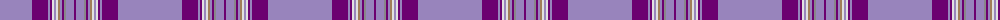

The parent of this is [Florence (Fashion)](/tartans/b/64/p16/b2/p2/ln2/b2/ln2/lt2/b2/p2/n2/b8/p/2/)

This was sourced from tartans-authority.  It is a [13 stripes tartan](/stripes/stripes13/).

Original link http://www.tartansauthority.com/tartan-ferret/display/4871/

## Thread count
B/64 P16 B2 P2 LN2 B2 LN2 LT2 B2 P2 N2 B8 P/2

## Palette
Each colour and its ΔE from the base-6 reference it is a variant of.

| Colour | Shade | Base | ΔE (OKLab) |
|---|---|---|---|
| B |  `#9884BC` | R  | 0.26 |
| LN |  `#E0E0E0` | W  | 0.06 |
| LT |  `#A07C58` | R  | 0.19 |
| N |  `#888888` | R  | 0.24 |
| P |  `#6C0070` | B  | 0.15 |

ID: /variants/b/64/p16/b2/p2/ln2/b2/ln2/lt2/b2/p2/n2/b8/p/2-b9884bc-lne0e0e0-lta07c58-n888888-p6c0070/
