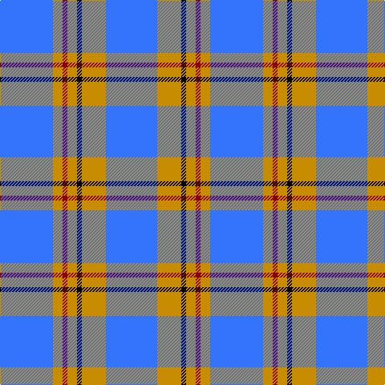

The parent of this is [Carlisle Family (Name)](/tartans/b/66/dy12/dr6/dy12/k6/dy30/b/64/)

This was sourced from tartans-authority.  It is a [7 stripes tartan](/stripes/stripes7/).

Original link http://www.tartansauthority.com/tartan-ferret/display/674/

## Thread count
B/66 DY12 DR6 DY12 K6 DY30 B/64

## Palette
Each colour and its ΔE from the base-6 reference it is a variant of.

| Colour | Shade | Base | ΔE (OKLab) |
|---|---|---|---|
| B |  `#3474FC` | B  | 0.23 |
| DR |  `#8C0000` | R  | 0.13 |
| DY |  `#C88C00` | Y  | 0.15 |
| K |  `#000000` | K  | 0.00 |

# Sample pattern

ID: /variants/b/66/dy12/dr6/dy12/k6/dy30/b/64-b3474fc-dr8c0000-dyc88c00-k000000/
