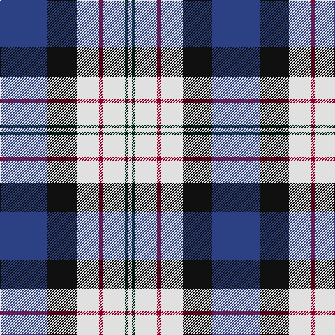

The parent of this is [Ferguson Dress #2](/tartans/b/68/k42/ln32/dr5/ln32/dg4/ln/6/)

This was sourced from register-of-tartans.  It is a [7 stripes tartan](/stripes/stripes7/).

Original link https://www.tartanregister.gov.uk/tartanDetails.aspx?ref=1162

## Thread count
B/68 K42 LN32 DR5 LN32 DG4 LN/6

## Palette
Each colour and its ΔE from the base-6 reference it is a variant of.

| Colour | Shade | Base | ΔE (OKLab) |
|---|---|---|---|
| B |  `#2C4084` | B  | 0.00 |
| DG |  `#002814` | B  | 0.21 |
| DR |  `#960028` | R  | 0.11 |
| K |  `#101010` | K  | 0.17 |
| LN |  `#E0E0E0` | W  | 0.06 |

# Sample pattern

ID: /variants/b/68/k42/ln32/dr5/ln32/dg4/ln/6-b2c4084-dg002814-dr960028-k101010-lne0e0e0/
