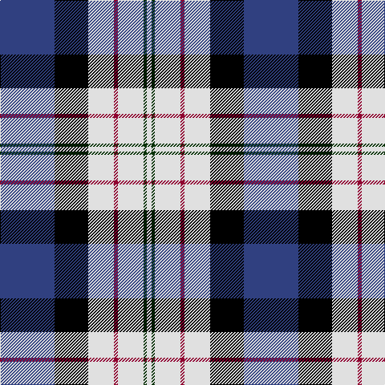

The parent of this is [Ferguson, dress](/tartans/b/68/k42/ln32/dr5/ln32/dg4/ln/6/)

This was sourced from weddslist.  It is a [7 stripes tartan](/stripes/stripes7/).

Original link http://www.weddslist.com/cgi-bin/tartans/pg.pl?source=sts

## Thread count
B/68 K42 LN32 DR5 LN32 DG4 LN/6

## Palette
Each colour and its ΔE from the base-6 reference it is a variant of.

| Colour | Shade | Base | ΔE (OKLab) |
|---|---|---|---|
| B |  `#304080` | B  | 0.01 |
| DG |  `#003000` | G  | 0.18 |
| DR |  `#900030` | R  | 0.13 |
| K |  `#000000` | K  | 0.00 |
| LN |  `#E0E0E0` | W  | 0.06 |

# Sample pattern

ID: /variants/b/68/k42/ln32/dr5/ln32/dg4/ln/6-b304080-dg003000-dr900030-k000000-lne0e0e0/
