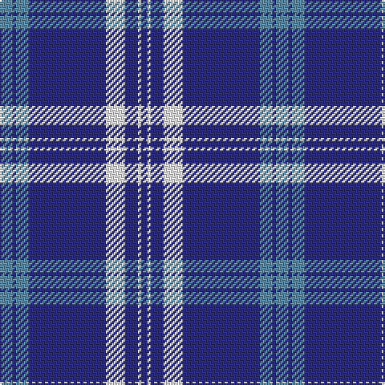

The parent of this is [Antigonish](/tartans/b/8/db2/b8/db48/w12/db8/w2/db/4/)

This was sourced from register-of-tartans.  It is a [8 stripes tartan](/stripes/stripes8/).

Original link https://www.tartanregister.gov.uk/tartanDetails.aspx?ref=95

## Thread count
B/8 DB2 B8 DB48 W12 DB8 W2 DB/4

## Palette
Each colour and its ΔE from the base-6 reference it is a variant of.

| Colour | Shade | Base | ΔE (OKLab) |
|---|---|---|---|
| B |  `#5C8CA8` | B  | 0.23 |
| DB |  `#2C2C80` | B  | 0.05 |
| W |  `#FCFCFC` | W  | 0.03 |

# Sample pattern

ID: /variants/b/8/db2/b8/db48/w12/db8/w2/db/4-b5c8ca8-db2c2c80-wfcfcfc/
