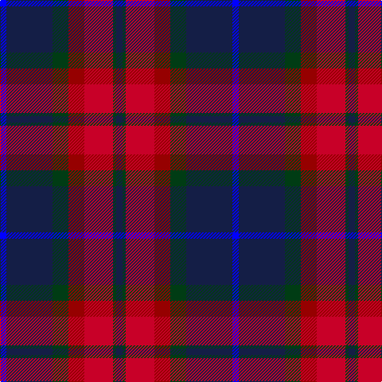

The parent of this is [Ross Dempster (Personal)](/tartans/b/8/db58/dg20/dr20/r36/dg4/db/8/)

This was sourced from register-of-tartans.  It is a [7 stripes tartan](/stripes/stripes7/).

Original link https://www.tartanregister.gov.uk/tartanDetails.aspx?ref=912

## Thread count
B/8 DB58 DG20 DR20 R36 DG4 DB/8

## Palette
Each colour and its ΔE from the base-6 reference it is a variant of.

| Colour | Shade | Base | ΔE (OKLab) |
|---|---|---|---|
| B |  `#0000FF` | B  | 0.21 |
| DB |  `#141E46` | B  | 0.15 |
| DG |  `#003C14` | G  | 0.14 |
| DR |  `#960000` | R  | 0.11 |
| R |  `#C80028` | R  | 0.02 |

# Sample pattern

ID: /variants/b/8/db58/dg20/dr20/r36/dg4/db/8-b0000ff-db141e46-dg003c14-dr960000-rc80028/
