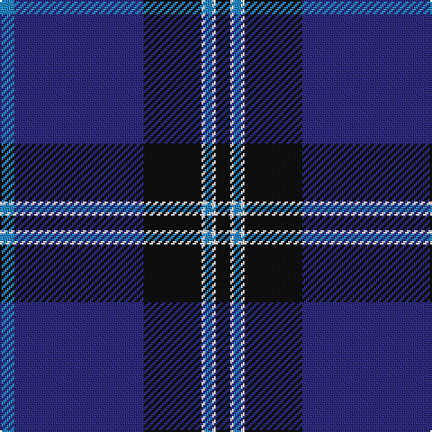

The parent of this is [NHS Grampian](/tartans/b/8/db72/k32/w2/b4/w2/k/8/)

This was sourced from register-of-tartans.  It is a [7 stripes tartan](/stripes/stripes7/).

Original link https://www.tartanregister.gov.uk/tartanDetails.aspx?ref=3098

## Thread count
B/8 DB72 K32 W2 B4 W2 K/8

## Palette
Each colour and its ΔE from the base-6 reference it is a variant of.

| Colour | Shade | Base | ΔE (OKLab) |
|---|---|---|---|
| B |  `#2888C4` | B  | 0.21 |
| DB |  `#2C2C80` | B  | 0.05 |
| K |  `#101010` | K  | 0.17 |
| W |  `#FCFCFC` | W  | 0.03 |

# Sample pattern

ID: /variants/b/8/db72/k32/w2/b4/w2/k/8-b2888c4-db2c2c80-k101010-wfcfcfc/
