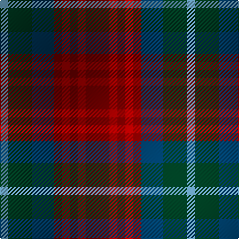

The parent of this is [Akins Clan Tartan Tartan Number: 2426. Earliest known date: 1822 This is the `Approved` tartan for the Akins Clan See products available Copyright © Blair Urquhart, Comrie, 2015](/tartans/b/8/dg24/db22/dr8/r8/dr8/r8/dr/24/)

This was sourced from house-of-tartan.  It is a [8 stripes tartan](/stripes/stripes8/).

Original link http://www.house-of-tartan.scotland.net/house/TartanViewjs.asp?colr=Def&tnam=2426

## Thread count
B/8 DG24 DB22 DR8 R8 DR8 R8 DR/24

## Palette
Each colour and its ΔE from the base-6 reference it is a variant of.

| Colour | Shade | Base | ΔE (OKLab) |
|---|---|---|---|
| B |  `#5C8CA8` | B  | 0.23 |
| DB |  `#003C64` | B  | 0.07 |
| DG |  `#003820` | G  | 0.16 |
| DR |  `#880000` | R  | 0.14 |
| R |  `#C80000` | R  | 0.00 |

# Sample pattern

ID: /variants/b/8/dg24/db22/dr8/r8/dr8/r8/dr/24-b5c8ca8-db003c64-dg003820-dr880000-rc80000/
