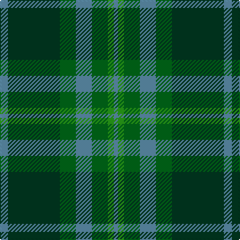

The parent of this is [Valley of the Green (The ) Canadian Tartan Tartan Number: 148. Earliest known date: 1968 Specimen from Miss K Sinclair 1968 See products available Copyright © Blair Urquhart, Comrie, 2015](/tartans/b/8/dg52/g16/b16/g16/ga6/b/4/)

This was sourced from house-of-tartan.  It is a [7 stripes tartan](/stripes/stripes7/).

Original link http://www.house-of-tartan.scotland.net/house/TartanViewjs.asp?colr=Def&tnam=148

## Thread count
B/8 DG52 G16 B16 G16 Ga6 B/4

## Palette
Each colour and its ΔE from the base-6 reference it is a variant of.

| Colour | Shade | Base | ΔE (OKLab) |
|---|---|---|---|
| B |  `#5C8CA8` | B  | 0.23 |
| DG |  `#003820` | G  | 0.16 |
| G |  `#006818` | G  | 0.02 |
| Ga |  `#289C18` | G  | 0.18 |

# Sample pattern

ID: /variants/b/8/dg52/g16/b16/g16/ga6/b/4-b5c8ca8-dg003820-g006818-ga289c18/
