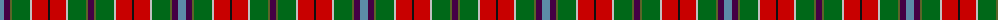

The parent of this is [Wilson's No.121](/tartans/b/8/dp6/ga2/g18/n2/r16/k2/r16/n2/g18/ga2/dp/6/)

This was sourced from register-of-tartans.  It is a [12 stripes tartan](/stripes/stripes12/).

Original link https://www.tartanregister.gov.uk/tartanDetails.aspx?ref=4686

## Thread count
B/8 DP6 Ga2 G18 N2 R16 K2 R16 N2 G18 Ga2 DP/6

## Palette
Each colour and its ΔE from the base-6 reference it is a variant of.

| Colour | Shade | Base | ΔE (OKLab) |
|---|---|---|---|
| B |  `#5C8CA8` | B  | 0.23 |
| DG |  `#003820` | G  | 0.16 |
| DP |  `#440044` | B  | 0.17 |
| G |  `#006818` | G  | 0.02 |
| Ga |  `#5C6428` | G  | 0.09 |
| K |  `#101010` | K  | 0.17 |
| LG |  `#789484` | G  | 0.23 |
| N |  `#C0C0C0` | W  | 0.16 |
| R |  `#C80000` | R  | 0.00 |
| Ra |  `#C80000` | R  | 0.00 |

ID: /variants/b/8/dp6/ga2/g18/n2/r16/k2/r16/n2/g18/ga2/dp/6-b5c8ca8-dg003820-dp440044-g006818-ga5c6428-k101010-lg789484-nc0c0c0-rc80000-rac80000/
