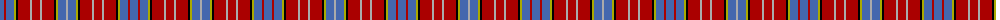

The parent of this is [Ogilvy D](/tartans/b/8/dr2/b8/lg2/k2/dr12/n2/dr8/n2/dr12/k2/lg2/b8/n/2/)

This was sourced from weddslist.  It is a [14 stripes tartan](/stripes/stripes14/).

Original link http://www.weddslist.com/cgi-bin/tartans/pg.pl?source=x

## Thread count
B/8 DR2 B8 LG2 K2 DR12 N2 DR8 N2 DR12 K2 LG2 B8 N/2

## Palette
Each colour and its ΔE from the base-6 reference it is a variant of.

| Colour | Shade | Base | ΔE (OKLab) |
|---|---|---|---|
| B |  `#4367AE` | B  | 0.13 |
| DR |  `#AA0000` | R  | 0.06 |
| K |  `#000000` | K  | 0.00 |
| LG |  `#AAAA00` | Y  | 0.11 |
| N |  `#AAAAAA` | Y  | 0.19 |

ID: /variants/b/8/dr2/b8/lg2/k2/dr12/n2/dr8/n2/dr12/k2/lg2/b8/n/2-b4367ae-draa0000-k000000-lgaaaa00-naaaaaa/
