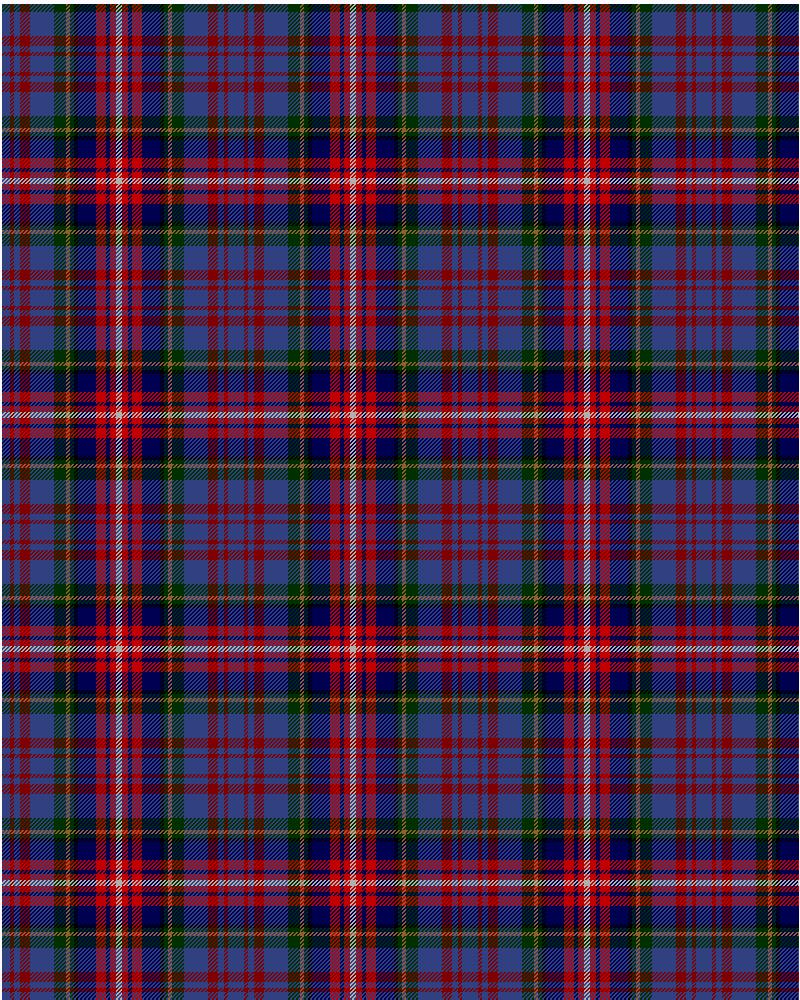

Hyndman (Omagh)

This was sourced from <no value>.  It is a 14 stripes tartan.

Original link http://www.weddslist.com/cgi-bin/tartans/pg.pl?source=sts

## Thread count
B/8 DR4 B6 DR10 B24 DG12 LT4 DG4 K4 DB18 R10 DB4 R6 N/3

## Palette
B#304080 DB#000050 DG#003000 DR#800000 K#000000 LT#906030 N#B0B0B0 R#C00000

# Sample pattern

ID: /variants/b/8/dr4/b6/dr10/b24/dg12/lt4/dg4/k4/db18/r10/db4/r6/n/3-b304080-db000050-dg003000-dr800000-k000000-lt906030-nb0b0b0-rc00000