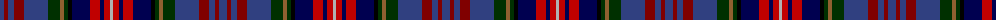

The parent of this is [Hyndman (Omagh)](/tartans/b/8/dr4/b6/dr10/b24/dg12/lt4/dg4/k4/db18/r10/db4/r6/n/3/)

This was sourced from weddslist.  It is a [14 stripes tartan](/stripes/stripes14/).

Original link http://www.weddslist.com/cgi-bin/tartans/pg.pl?source=sts

## Thread count
B/8 DR4 B6 DR10 B24 DG12 LT4 DG4 K4 DB18 R10 DB4 R6 N/3

## Palette
Each colour and its ΔE from the base-6 reference it is a variant of.

| Colour | Shade | Base | ΔE (OKLab) |
|---|---|---|---|
| B |  `#304080` | B  | 0.01 |
| DB |  `#000050` | B  | 0.20 |
| DG |  `#003000` | G  | 0.18 |
| DR |  `#800000` | R  | 0.16 |
| K |  `#000000` | K  | 0.00 |
| LT |  `#906030` | R  | 0.15 |
| N |  `#B0B0B0` | Y  | 0.18 |
| R |  `#C00000` | R  | 0.02 |

ID: /variants/b/8/dr4/b6/dr10/b24/dg12/lt4/dg4/k4/db18/r10/db4/r6/n/3-b304080-db000050-dg003000-dr800000-k000000-lt906030-nb0b0b0-rc00000/
