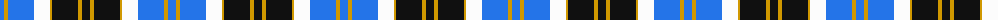

The parent of this is [Bannockbane Blue #1](/tartans/b/8/dy4/b26/w16/dy2/k26/dy4/k/8/)

This was sourced from register-of-tartans.  It is a [8 stripes tartan](/stripes/stripes8/).

Original link https://www.tartanregister.gov.uk/tartanDetails.aspx?ref=195

## Thread count
B/8 DY4 B26 W16 DY2 K26 DY4 K/8

## Palette
Each colour and its ΔE from the base-6 reference it is a variant of.

| Colour | Shade | Base | ΔE (OKLab) |
|---|---|---|---|
| B |  `#2474E8` | B  | 0.20 |
| DY |  `#D09800` | Y  | 0.11 |
| K |  `#101010` | K  | 0.17 |
| W |  `#FCFCFC` | W  | 0.03 |

# Sample pattern

ID: /variants/b/8/dy4/b26/w16/dy2/k26/dy4/k/8-b2474e8-dyd09800-k101010-wfcfcfc/
