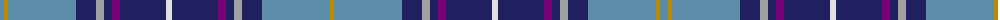

The parent of this is [Heirloom Blue Alba](/tartans/b/8/dy4/b68/db20/n8/db8/p8/db46/ln6/db46/p8/db8/n8/db20/b68/dy/4/)

This was sourced from register-of-tartans.  It is a [16 stripes tartan](/stripes/stripes16/).

Original link https://www.tartanregister.gov.uk/tartanDetails.aspx?ref=1678

## Thread count
B/8 DY4 B68 DB20 N8 DB8 P8 DB46 LN6 DB46 P8 DB8 N8 DB20 B68 DY/4

## Palette
Each colour and its ΔE from the base-6 reference it is a variant of.

| Colour | Shade | Base | ΔE (OKLab) |
|---|---|---|---|
| B |  `#5C8CA8` | B  | 0.23 |
| DB |  `#202060` | B  | 0.11 |
| DR |  `#901C38` | R  | 0.12 |
| DY |  `#BC8C00` | Y  | 0.16 |
| LN |  `#E0E0E0` | W  | 0.06 |
| N |  `#A0A0A0` | Y  | 0.20 |
| P |  `#780078` | B  | 0.16 |

ID: /variants/b/8/dy4/b68/db20/n8/db8/p8/db46/ln6/db46/p8/db8/n8/db20/b68/dy/4-b5c8ca8-db202060-dr901c38-dybc8c00-lne0e0e0-na0a0a0-p780078/
