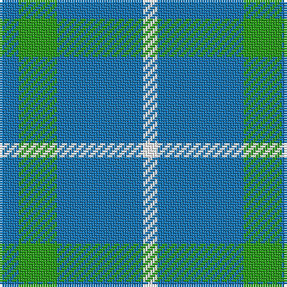

The parent of this is [Blue Meadow](/tartans/b/8/g16/b36/w/6/)

This was sourced from register-of-tartans.  It is a [4 stripes tartan](/stripes/stripes4/).

Original link https://www.tartanregister.gov.uk/tartanDetails.aspx?ref=4954

## Thread count
B/8 G16 B36 W/6

## Palette
Each colour and its ΔE from the base-6 reference it is a variant of.

| Colour | Shade | Base | ΔE (OKLab) |
|---|---|---|---|
| B |  `#1474B4` | B  | 0.15 |
| G |  `#289C18` | G  | 0.18 |
| W |  `#FFFFFF` | W  | 0.03 |

# Sample pattern

ID: /variants/b/8/g16/b36/w/6-b1474b4-g289c18-wffffff/
